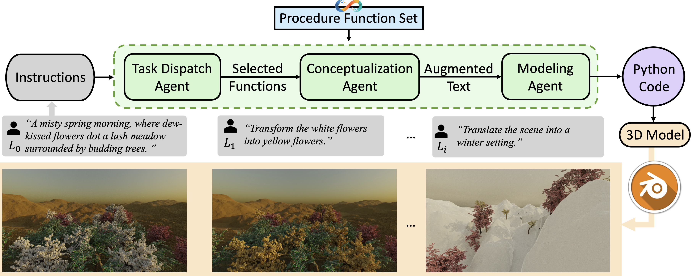
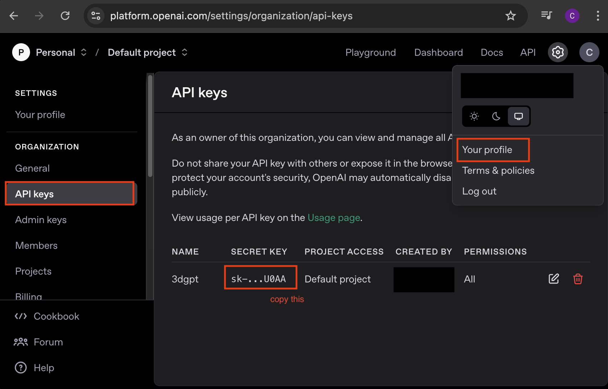

# 🏔️🤖 3D-GPT: Procedural 3D Modeling with Large Language Models 

**🏆 3DV Conference**

## 👥 Authors

**Chunyi Sun👩**\*, **Junlin Han👱**\*, Weijian Deng👱, Xinlong Wang👱, Zishan Qin👩, Stephen Gould‍️👨‍🦱

## 🔗 Project Page

[https://chuny1.github.io/3DGPT/3dgpt.html](https://chuny1.github.io/3DGPT/3dgpt.html)

---

## 🚀 Current & Upcoming Releases

This repository is part of the official implementation of our paper, **3D-GPT: Procedural 3D Modeling with Large Language Models**. We are gradually releasing different components of our project according to the following plan:

### ✅ Current Release: Agent Implementation

We are currently releasing the agent implementation, which includes:

- The core agent logic
- Example usage demonstrating how to call the agent to generate a Python script that can control the **Infinigen** generation.
- The `LLM/agents/` directory contains the implementation of two agents.
- The `LLM/documents/` directory contains the example function documentation format, where you can add functions as many as you want.
- Running `LLM/parser.py` will provide detailed output about how different agents interact with each other and how it infers function parameters.

### 🔜 Upcoming Releases

We have made significant modifications to many functions, making them easier for LLMs to understand while enhancing their control capabilities. Our upcoming releases include:

- **Modified Infinigen (by March 25, before 3DV conference)**: We will provide our modified version of **Infinigen**, improving its adaptability to LLM-generated scripts.
- **LLM Parser Enhancement**: Instead of generating Python scripts, the LLM parser will generate a **configuration file** to control Infinigen. This change will make the process more user-friendly and support **human-assisted editing**.

Stay tuned for these updates!

---

## 🛠 Installation & Usage

Follow the instructions below to set up and run the current release:

### 1️⃣ Install Infinigen

Follow the official Infinigen repository for installation and setup: [https://github.com/princeton-vl/infinigen](https://github.com/princeton-vl/infinigen)

### 2️⃣ Install Dependencies

```bash
# Clone the repository
git clone git@github.com:Chuny1/3DGPT.git

# Install required Python packages
pip install openai==0.27.8
```

### 3️⃣ Setup OpenAI API Key

To use OpenAI's LLMs, you need to obtain an API key:

- Visit the OpenAI website and generate an API key.
- Add your personal API key to `parser.py`. **Do not share your API key.**



### 4️⃣ Choose GPT Model

You can select the GPT model you want to use by visiting: [https://platform.openai.com/docs/api-reference/chat](https://platform.openai.com/docs/api-reference/chat)

### 5️⃣ Run the Agent

```bash
python LLM/parser.py
```
---

## 📚 Citation

If you find this work useful, please consider citing our paper:

```
@article{sun20233d,
  title={3d-gpt: Procedural 3d modeling with large language models},
  author={Sun, Chunyi and Han, Junlin and Deng, Weijian and Wang, Xinlong and Qin, Zishan and Gould, Stephen},
  journal={arXiv preprint arXiv:2310.12945},
  year={2023}
}
```

